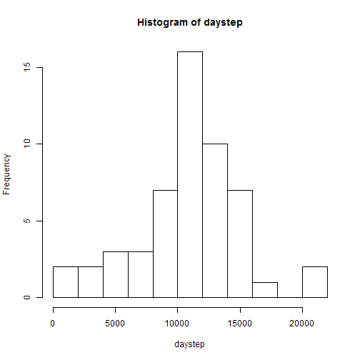
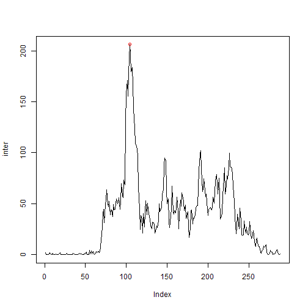
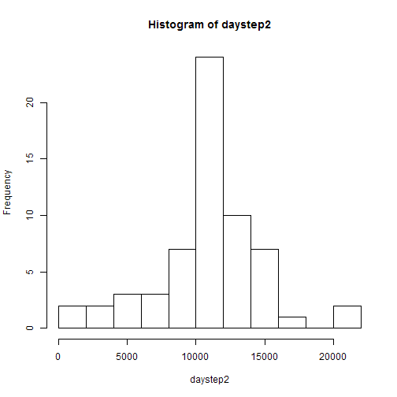

### Loading and preprocessing the data
Show any code that is needed to   
1.  Load the data (i.e. read.csv())   
2.  Process/transform the data (if necessary) into a format suitable for your analysis


```r
    if (!file.exists("activity.csv")) unzip("repdata_data_activity.zip")
    act<-read.csv("activity.csv")
    str(act)
```

```
## 'data.frame':	17568 obs. of  3 variables:
##  $ steps   : int  NA NA NA NA NA NA NA NA NA NA ...
##  $ date    : Factor w/ 61 levels "2012-10-01","2012-10-02",..: 1 1 1 1 1 1 1 1 1 1 ...
##  $ interval: int  0 5 10 15 20 25 30 35 40 45 ...
```

### What is mean total number of steps taken per day?
For this part of the assignment, you can ignore the missing values in the dataset.

1.  Calculate the total number of steps taken per day

```r
    daystep<-tapply(act$steps, act$date, sum)
    # NAs not removed in 'sum' function because default na.rm=FALSE
```

2.  Make a histogram of the total number of steps taken each day

```r
    # NAs not reflected in histogran
    hist(daystep, breaks = 10)
```

 

3.    Calculate and report the mean and median of the total number of steps taken per day

```r
    #use na.rm=TRUE because 'daystep' contain NAs.
    ma<-mean(daystep, na.rm = TRUE)
    as.character(round(ma,2))
```

```
## [1] "10766.19"
```

```r
    mm<-median(daystep, na.rm = TRUE)
    mm
```

```
## [1] 10765
```
For the total number of steps taken per day **mean= 10766.19** and **median= 10765**.  

### What is the average daily activity pattern?
1.  Make a time series plot (i.e. type = "l") of the 5-minute interval (x-axis) and the average number of steps taken, averaged across all days (y-axis)

```r
    inter<-tapply(act$steps, act$interval, mean, na.rm=TRUE)
    # NAs not reflected in histogran
    plot(inter, type="l")
    a<-which(inter==max(inter)) #index of max average
    points(a,inter[a], col=2 )  #plot max average value in red
```

 

I failed to convert 5-minute intervals to "hh:mm" format, so I used for plotting my vector of averaged data **inter** "as is", with data on y-axis and data indices [1:288] as x-axis.  (((   
At least it gives plot identical to required, just incorrect lables at  x-axis ticks.    

.

2.  Which 5-minute interval, on average across all the days in the dataset, contains the maximum number of steps?

```r
    a<-which(inter==max(inter))
    names(inter[a])  # interval
```

```
## [1] "835"
```

```r
inter[a]  #max average steps
```

```
##      835 
## 206.1698
```

### Imputing missing values

Note that there are a number of days/intervals where there are missing values (coded as NA). The presence of missing days may introduce bias into some calculations or summaries of the data.

1.  Calculate and report the total number of missing values in the dataset (i.e. the total number of rows with NAs)

```r
    sum(is.na(act$steps))
```

```
## [1] 2304
```
Total number of rows with **NAs=2304**.

2.  There are no individual 5-minute intervals with missing data but rather there are 8 full days when no data at all were collected - one complete day equals 60/5x24=288 points of missing data. I will fill in NAs with the average steps count for corresponding 5-minute intervals from *inter* vector 

3.    Create a new dataset *act2* that is equal to the original dataset *act*  but with the missing data filled in. NB: averaged data used to replace NAs are in *numeric* format, not *integer*, hence all data in *act2$steps* will get coerced to *numeric* format ). 


```r
    act2<- act  # copy dataset
    bad<- is.na(act$steps)   # find NAs
    act2$steps[bad]<- inter  
    #vector 'inter' of 288=24*12 average 5-minute intervals 
	#is recycled over NA values of 'act2$steps' 
	#to replace NAs.
```

4.  Make a histogram of the total number of steps taken each day

```r
    daystep2<-tapply(act2$steps, act2$date, sum)
    hist(daystep2, breaks = 10)
```

 

Calculate and report the **mean** and **median** total number of steps taken per day. 

```r
    # no missing data (NAs) in 'daystep2'
    mean(daystep2)
```

```
## [1] 10766.19
```

```r
    median(daystep2)
```

```
## [1] 10766.19
```

Q1 - Do these values differ from the estimates from the first part of the assignment?   
Q2 - What is the impact of imputing missing data on the estimates of the total daily number of steps? 

A1 - With our strategy of replacing NAs with the average steps count for corresponding 5-minute intervals, there is no difference with the original **mean** and **median** estimates.   
A2 - Since we introduced 8 more days with 10766 steps each (10766 equals the average steps per day) we did not changed the average steps per day, but reduced the dispersion of daily average data, which is not good. This is reflected in histogram differences.

  
### Are there differences in activity patterns between weekdays and weekends?   

1.  Create a new factor variable in the dataset with two levels – “weekday” and “weekend” indicating whether a given date is a weekday or weekend day.


```r
    p=as.POSIXct(act$date)
    p=weekdays(p)
    wend<-which(p %in% c("Saturday","Sunday"))
    p[wend]=c("weekend")
    p[-wend]=c("weekday")
    act$date=as.factor(p)
```


####   *Sorry pals, that's all.*    


 


